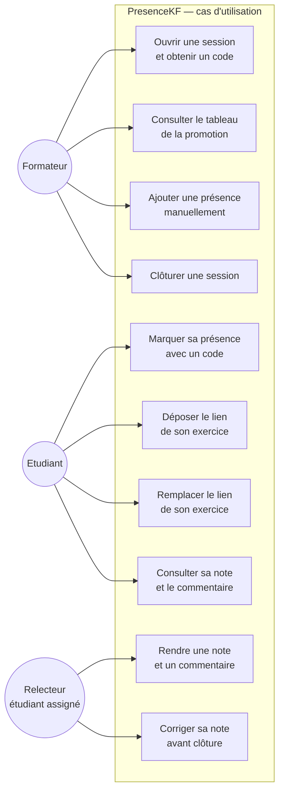

# D1 — Diagramme de cas d'utilisation

**Source :** `docs/CAHIER_DES_CHARGES.md` — sections 2 (acteurs) et 4 (exigences fonctionnelles).

## Légende des renvois

| Cas                           | Exigence      | Règle                   |
| ----------------------------- | ------------- | ----------------------- |
| Ouvrir une session            | EF1           | RG1                     |
| Consulter le tableau          | EF12, EF13    | —                       |
| Ajouter une présence manuelle | EF5           | RG11 (Q14)              |
| Clôturer une session          | EF16          | RG12                    |
| Marquer sa présence           | EF2, EF3, EF4 | RG1, RG13, RG15, RG16   |
| Déposer le lien               | EF6, EF7      | RG9, RG14               |
| Remplacer le lien             | EF15          | RG10 (Q13)              |
| Consulter sa note             | EF14          | RG6 (Q8)                |
| Rendre une note               | EF9, EF11     | RG2, RG3, RG4, RG5      |
| Corriger sa note              | EF10          | RG7 (Q10 prime sur Q15) |
