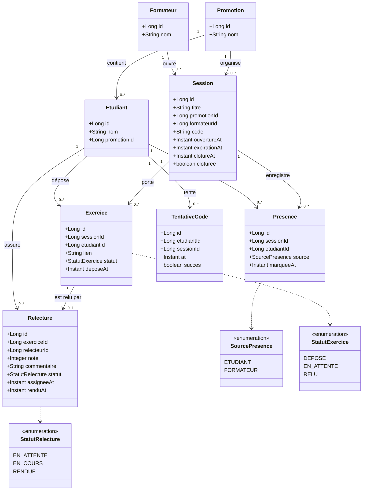

# D2 — Diagramme de classes / modèle de données

**Source :** `docs/CAHIER_DES_CHARGES.md` — sections 2 (relecteur = état d'un étudiant) et 6 (règles de gestion).
**Contrainte :** doit rester cohérent avec les migrations Flyway `V1__init.sql` et suivantes (B5).

## Règles de cardinalité portées par le modèle

| Relation                                    | Cardinalité                       | Règle                         |
| ------------------------------------------- | --------------------------------- | ----------------------------- |
| Etudiant ↔ Presence                         | 1..\* mais **unique par session** | RG13                          |
| Etudiant ↔ Exercice                         | 1..\* mais **unique par session** | RG14                          |
| Exercice ↔ Relecture                        | **0..1**                          | RG4 (Q6) + EF8 conditionnelle |
| Relecture.relecteurId ≠ Exercice.etudiantId | contrainte applicative            | RG2 (Q5)                      |
