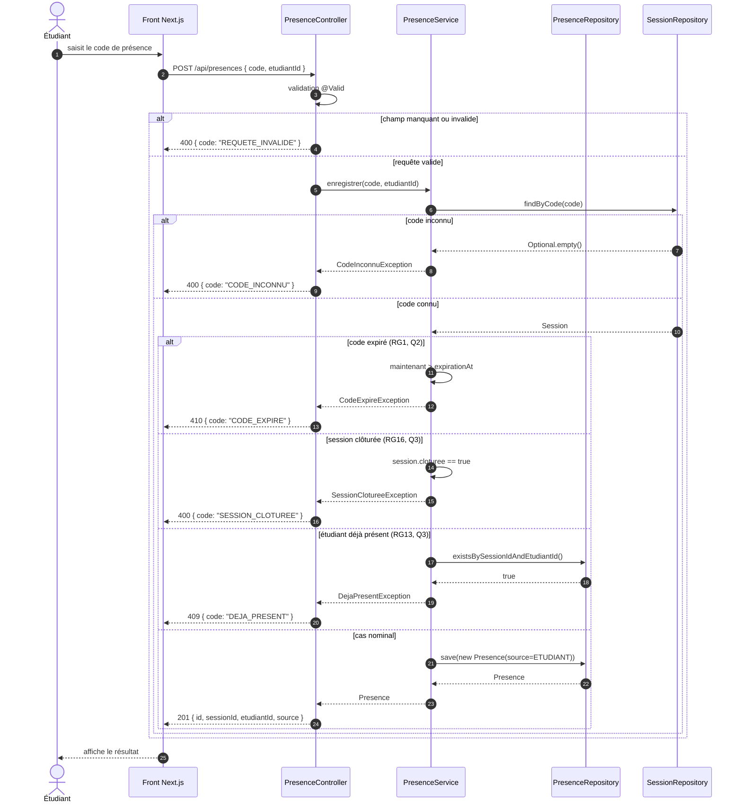

# D3 — Séquence : « marquer sa présence »

**Source :** `api/contrat.yaml` — `POST /api/presences`.
**Codes HTTP couverts :** 201 (nominal), 410 (CODE_EXPIRE), 409 (DEJA_PRESENT), 400 (CODE_INCONNU).

## Correspondance avec le contrat

| Cas | Code HTTP | Corps |
|---|---|---|
| Nominal | `201` | `{ id, sessionId, etudiantId, source }` |
| Code inconnu | `400` | `{ code: "CODE_INCONNU", message }` |
| Champ manquant | `400` | `{ code: "REQUETE_INVALIDE", message }` |
| Code expiré | `410` | `{ code: "CODE_EXPIRE", message }` |
| Déjà présent | `409` | `{ code: "DEJA_PRESENT", message }` |
| Session clôturée | `400` | `{ code: "SESSION_CLOTUREE", message }` |