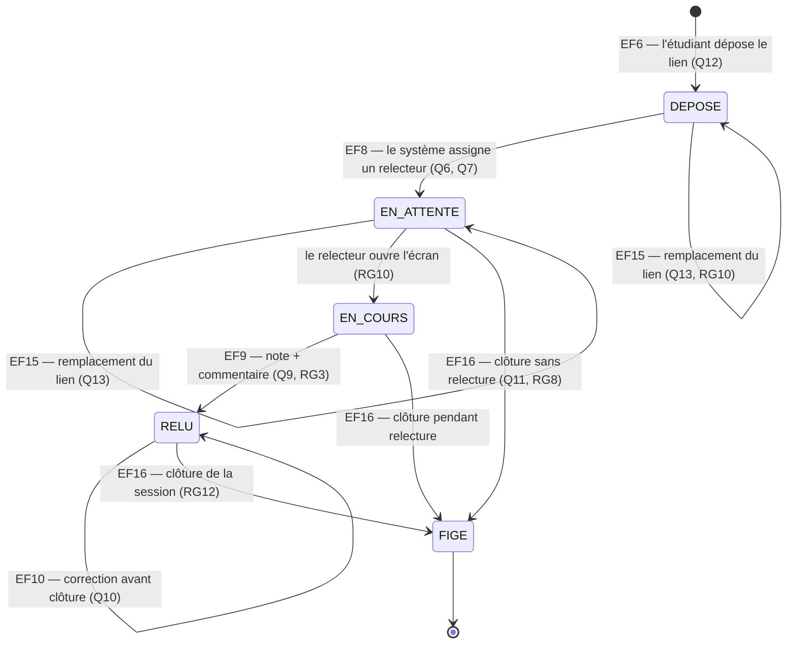

# D4 — États-transitions : cycle de vie d'un exercice (bonus)

**Source :** `docs/CAHIER_DES_CHARGES.md` — sections 3, 4 (EF6–EF15) et 6 (RG4, RG7, RG8, RG9, RG10).

## Lecture

| État | Signification |
|---|---|
| `DEPOSE` | Lien déposé, aucun relecteur assigné (cas « aucun présent ») |
| `EN_ATTENTE` | Relecteur assigné, note pas encore rendue |
| `EN_COURS` | Relecteur a ouvert l'écran, lien non remplaçable (Q13) |
| `RELU` | Note + commentaire rendus, modifiables jusqu'à clôture (Q10) |
| `FIGE` | Session clôturée, note définitive (RG12) |